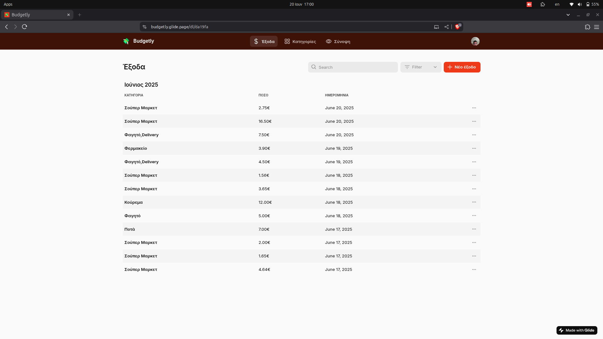
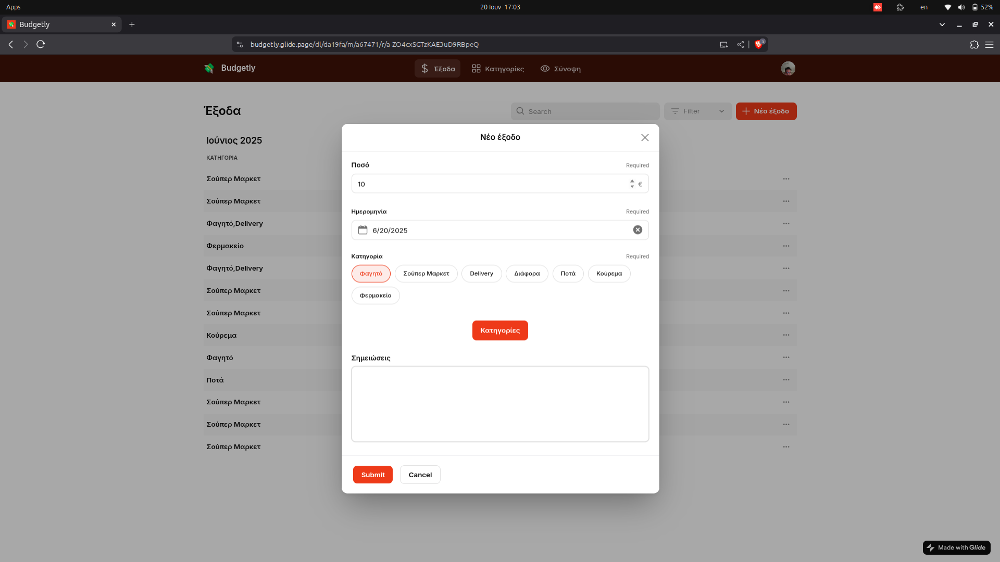
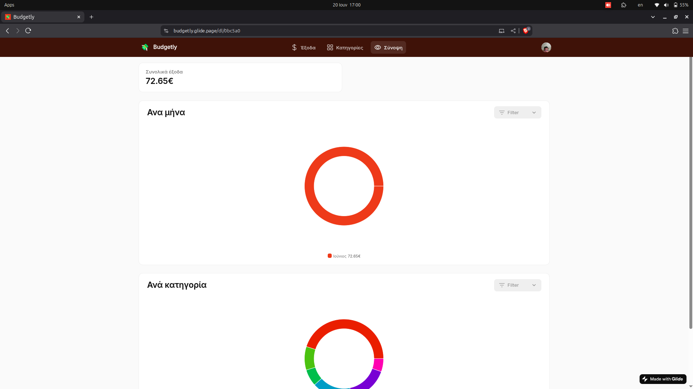
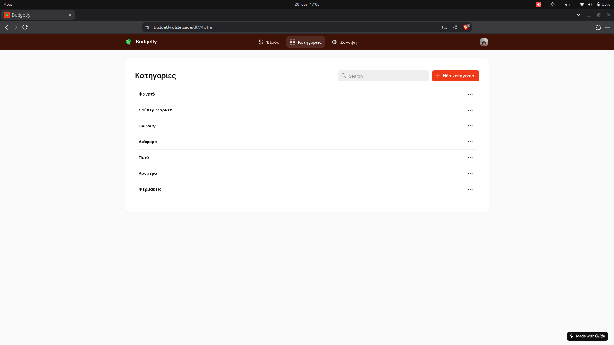

# Budgetly

Μια no-code web εφαρμογή για την παρακολούθηση προσωπικών χρηματικών εξόδων, υλοποιημένη με το GlideApps.  
Η εφαρμογή είναι προσβάσιμη από υπολογιστή και κινητό, και χρησιμοποιείται για την καταγραφή, κατηγοριοποίηση και ανάλυση εξόδων.

## Χαρακτηριστικά

- **Καταγραφή ημερήσιων εξόδων**  
  - Ποσό, κατηγορία, ημερομηνία
  - Προαιρετική σημείωση
  - Επεξεργασία / διαγραφή εξόδων
  - Φίλτρα εμφάνισης εξόδων

- **Διαχείριση κατηγοριών**  
  - Προσθήκη νέων κατηγοριών εξόδων

- **Συνοπτική προβολή**  
  - Συνολικά έξοδα
  - Pie charts με έξοδα ανά μήνα και ανά κατηγορία

- **Άλλα**
  - Προσαρμόσιμη ημερομηνία εξόδων
  - Δυνατότητα επεξεργασίας / διαγραφής κατηγοριών
  - Mobile-friendly & desktop-friendly

## Τεχνολογίες

- **GlideApps** 

## Σημειώσεις

- Η εφαρμογή είναι στα ελληνικά.  
- Προς το παρόν δεν υπάρχει υποστήριξη αλλαγής γλώσσας.
- Η εφαρμογή είναι λειτουργική αλλά υπό ανάπτυξη.

##  Screenshots

##  Demo

[Δοκιμάστε την εφαρμογή εδώ](https://budgetly.glide.page/)

---

## Ιδέες για μελλοντική ανάπτυξη

- Onboarding page για νέους χρήστες
- Υποστήριξη πολλών γλωσσών
- Επιπλέον φίλτρα και αναφορές
- Περισσότερο customization στα charts

---

